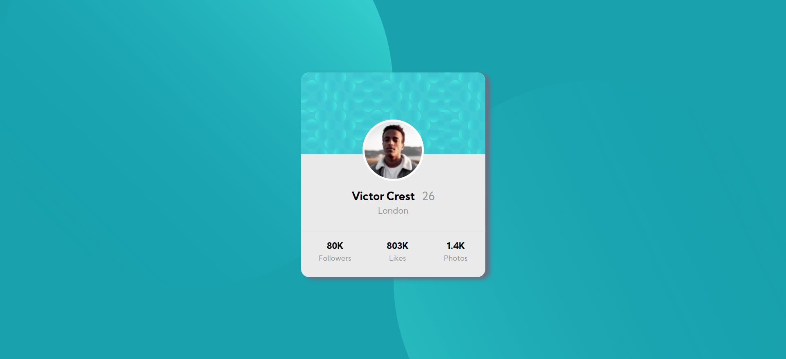
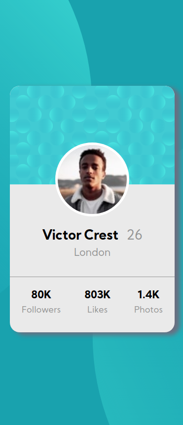

# Frontend Mentor - Profile card component solution

This is a solution to the [Profile card component challenge on Frontend Mentor](https://www.frontendmentor.io/challenges/profile-card-component-cfArpWshJ). Frontend Mentor challenges help you improve your coding skills by building realistic projects. 

## Table of contents

- [Overview](#overview)
  - [The challenge](#the-challenge)
  - [Screenshot](#screenshot)
  - [Links](#links)
- [My process](#my-process)
  - [Built with](#built-with)
  - [What I learned](#what-i-learned)
  - [Useful resources](#useful-resources)
- [Author](#author)
- [Acknowledgments](#acknowledgments)

## Overview

### The challenge

- Build out the project to the designs provided

### Screenshot

Desktop

Mobile

### Links

- Solution URL: [Github](https://github.com/karthisp/profile-card-component)
- Live Site URL: [Project site](https://karthisp.github.io/profile-card-component/)

## My process

1. Firstly I created a wireframe of the given design to come up with the HTML layout
2. 

### Built with
* HTML
* css

### What I learned
* I learnt how to work with SVGs for setting vibrant backgrounds for a web page.

## Author
- Website - [Karthik Sp](http://www.karthiksp.in/)
- Frontend Mentor - [@karthisp](https://www.frontendmentor.io/profile/karthisp)
- Linkedin - [Karthik Sp](https://www.linkedin.com/in/karthik-s-p-931345122/)

## Acknowledgments